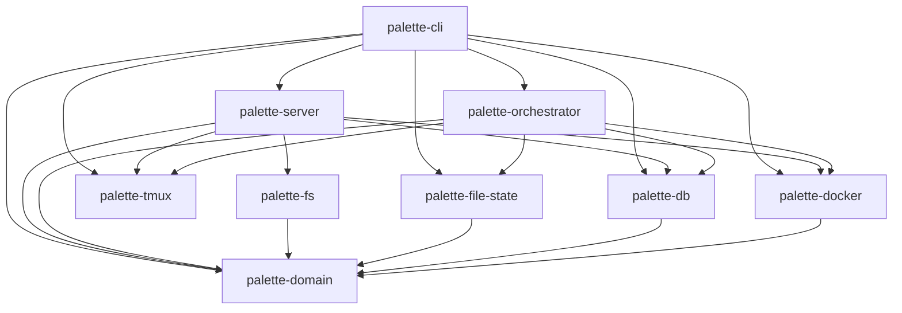

# Palette Design

## Crate Dependency Graph

```
palette-domain       (no dependencies — pure domain types)
palette-tmux         (no dependencies — terminal operations)
palette-db           → palette-domain
palette-docker       → palette-domain
palette-file-state   → palette-domain
palette-fs           → palette-domain
palette-orchestrator → palette-db, palette-docker, palette-domain, palette-file-state, palette-tmux
palette-server       → palette-db, palette-docker, palette-domain, palette-fs, palette-tmux
palette-cli          → palette-db, palette-docker, palette-domain, palette-file-state, palette-orchestrator, palette-server, palette-tmux
```



Note: palette-server depends on palette-orchestrator only as a dev-dependency (for integration tests), not in production code.

## Layer Responsibilities

| Crate | Role |
|---|---|
| palette-domain | Pure domain types (Task, Job, Workflow, etc.). No serde, no I/O, no external format dependencies. |
| palette-db | Database access. Owns DB-specific types (e.g. TaskRow). Implements domain traits (TaskStore, JobStore). |
| palette-fs | Filesystem access. Reads Blueprint YAML files and converts to domain types. Owns YAML deserialization types. |
| palette-file-state | Persists runtime state (PersistentState) to JSON files. |
| palette-docker | Docker container management. |
| palette-tmux | Terminal (tmux) session management. |
| palette-orchestrator | Orchestration logic. Processes rule engine effects, manages worker lifecycle. |
| palette-server | HTTP API layer. Owns API request/response types. Routes and handlers. |
| palette-cli | Entry point. Configuration loading, server startup. |

## Design Principles

- **Domain models are the shared language.** All communication between layers goes through palette-domain types. Each layer converts its own format-specific types (YAML, DB rows, API JSON) into domain types at the boundary. Domain types maintain invariants — the outer layers are responsible for validating and converting before handing data to the domain.
- **palette-domain has no external format dependencies.** Each layer defines its own serialization types and converts to/from domain types. Do not add serde to palette-domain.
- **Each layer owns its own types.** A YAML type in palette-fs, a DB row type in palette-db, and an API type in palette-server may have similar structure, but they represent different things — a file format, a storage format, and an API contract respectively. They are not interchangeable even when they look alike.
- **Dependencies flow inward.** All crates depend on palette-domain. Infrastructure crates (db, fs, docker, tmux) do not depend on each other. palette-server does not depend on palette-orchestrator in production.
