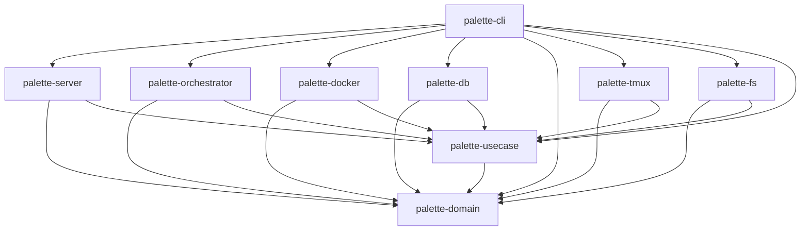

# Palette Design

## Crate Dependency Graph

```
palette-domain       (no dependencies — pure domain types)
palette-usecase      → palette-domain (trait definitions + Interactor)
palette-db           → palette-domain, palette-usecase
palette-docker       → palette-domain, palette-usecase
palette-fs           → palette-domain, palette-usecase
palette-tmux         → palette-domain, palette-usecase
palette-orchestrator → palette-domain, palette-usecase
palette-server       → palette-domain, palette-usecase
palette-cli          → palette-db, palette-docker, palette-domain, palette-fs, palette-orchestrator, palette-server, palette-tmux, palette-usecase
```



Note: palette-server depends on palette-orchestrator only as a dev-dependency (for integration tests), not in production code.

## Layer Responsibilities

| Crate | Role |
|---|---|
| palette-domain | Pure domain types (Task, TaskTree, TaskState, Job, Workflow, etc.) and validation rules (status transitions). No serde, no I/O, no external format dependencies. |
| palette-usecase | Use case layer (Interactor). Defines trait ports (ContainerRuntime, TerminalSession, DataStore, BlueprintReader) and the Interactor struct that mediates all external resource access. Also provides TaskStore (combines blueprint structure with execution state), RuleEngine, and TaskRuleEngine. Depends only on palette-domain. |
| palette-db | Database access. Owns DB-specific types (e.g. TaskRow). Returns domain types (TaskState). Implements DataStore trait. |
| palette-fs | Filesystem access. Reads Blueprint YAML files and converts to domain types (TaskTree). Owns YAML deserialization types. Implements BlueprintReader trait. |
| palette-docker | Docker container management. Implements ContainerRuntime trait. |
| palette-tmux | Terminal (tmux) session management. Implements TerminalSession trait. |
| palette-orchestrator | Orchestration logic. Processes rule engine effects, manages worker lifecycle. Accesses external resources exclusively through Interactor. |
| palette-server | HTTP API layer. Owns API request/response types. Routes and handlers. Accesses external resources exclusively through Interactor. |
| palette-cli | Entry point. Configuration loading, server startup. Assembles concrete implementations into Interactor and passes to orchestrator and server. |

## Design Principles

- **Domain models are the shared language.** All communication between layers goes through palette-domain types. Each layer converts its own format-specific types (YAML, DB rows, API JSON) into domain types at the boundary. Domain types maintain invariants — the outer layers are responsible for validating and converting before handing data to the domain.
- **palette-domain has no external format dependencies.** Each layer defines its own serialization types and converts to/from domain types. Do not add serde to palette-domain.
- **Each layer owns its own types.** A YAML type in palette-fs, a DB row type in palette-db, and an API type in palette-server may have similar structure, but they represent different things — a file format, a storage format, and an API contract respectively. They are not interchangeable even when they look alike.
- **Dependencies flow inward.** All crates depend on palette-domain. palette-usecase depends only on palette-domain. Infrastructure crates (db, fs, docker, tmux) implement palette-usecase traits but do not depend on each other. Application crates (orchestrator, server) depend on palette-usecase but not on infrastructure crates directly.
- **External access goes through Interactor.** The orchestrator and server never call infrastructure crates directly. All external resource access (database, Docker, tmux, filesystem) is mediated by the Interactor's trait objects, enabling mock-based testing.
- **Blueprint is the source of truth for task structure.** The task tree hierarchy (parent-child relationships, titles, plan paths, job types, dependencies) is defined in Blueprint YAML files. The database only stores execution state (task status). The use case layer (palette-usecase) combines these two sources to produce full Task objects via TaskStore.
